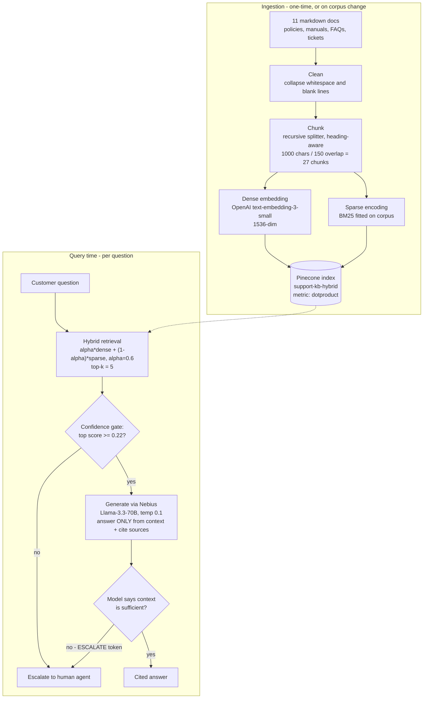

# System Design — LumenLeaf Customer Support RAG

> Living document. Each decision is logged with its rationale and trade-offs.
> Stack: LangChain + LangGraph · OpenAI embeddings · Pinecone (hybrid) · Nebius Token Factory (generation)

## Architecture overview

The two escalation paths are deliberate: the gate catches *retrieval* failures (nothing relevant in the KB), the model's ESCALATE token catches *generation-time* insufficiency (relevant-looking chunks that don't actually answer the question). Refusal was designed before the happy path, per the project framework.

---

## Decision log

### DD-01 · Chunking: recursive character splitting, structure-aware
**Decision.** `RecursiveCharacterTextSplitter`, 1000 chars (~250 tokens), 150 overlap, separator priority `\n## ` → `\n### ` → paragraph → line.

**Why.** The corpus is clean markdown with one topic per section, so splitting on headings first makes chunks coincide with self-contained policy/procedure units. Deterministic and free — no LLM calls at ingest.

**Trade-offs.** Size-bounded, not meaning-bounded: long sections still split mid-topic, and continuation chunks lose their heading (mitigated by overlap + source metadata). Tuned for structured markdown; would degrade on messy PDFs/HTML. True semantic chunking rejected as slower, non-deterministic, and overkill for an 11-doc corpus.

**Revisit when.** Corpus grows past ~100 docs or includes scanned/unstructured sources.

### DD-02 · Embedding model: OpenAI `text-embedding-3-small` (1536-dim)
**Decision.** Dense vectors from `text-embedding-3-small`; chunk size and model chosen together.

**Why.** ~250-token chunks carry enough signal for 1536 dims without diluting multiple topics into one vector ("match capacity" principle). 5× cheaper than `3-large` with near-par retrieval quality on short English support text; well supported by Pinecone tooling.

**Trade-offs.** English-centric (fine here; multilingual would favor a Cohere/BGE-m3 model). Proprietary API dependency — embeddings must be regenerated with the same model at query time forever, or the index rebuilt.

### DD-03 · Retrieval: hybrid dense + sparse in one Pinecone index
**Decision.** Every chunk stored with BOTH a dense vector (semantic) and a BM25 sparse vector (keyword). Single Pinecone serverless index, `dotproduct` metric (required for hybrid). Query-time fusion by convex combination: `α·dense + (1−α)·sparse`, **α = 0.6**, top-k = 5. BM25 parameters are fitted on the corpus at ingest and persisted (`data/bm25_params.json`) so query encoding matches document encoding.

**Why.** Pure dense misses exact identifiers — error codes (`LL-E45`), policy IDs (`POL-RET-02`), SKUs (`LL-B200`) — which dominate real support queries. Pure BM25 misses paraphrase/intent ("my light keeps blinking" → dimmer-interference doc). Hybrid covers both; α is a single tunable knob, and α=1/α=0 give us free pure-dense vs pure-sparse baselines for the evaluation report.

**Trade-offs.** BM25 params are corpus-frozen — adding documents requires refitting and re-upserting sparse vectors. Convex-combination fusion is simpler but cruder than reciprocal-rank fusion or a cross-encoder reranker (candidate future DD). Dotproduct metric means scores aren't cosine-normalized; the confidence threshold is calibrated empirically.

### DD-04 · Confidence gate before generation (refusal-first design)
**Decision.** If the top fused retrieval score < 0.45, skip generation entirely and return a human-escalation message. Independently, the generator is instructed to output `ESCALATE` when retrieved context doesn't answer the question.

**Why.** A support bot that hallucinates policies is worse than one that hands off. Gating before generation also saves a Nebius call on obvious misses.

**Trade-offs.** A fixed threshold on un-normalized dotproduct scores needs empirical calibration against the 20-query eval set; too high → over-escalation (poor first-contact resolution), too low → hallucination risk.

**Calibration (eval run #1, 2026-06-11).** Initial guess of 0.45 produced 100% retrieval hit@5 but only 29% first-contact resolution — the gate refused 12/17 answerable questions. Measured distributions: answerable top scores 0.229–0.65, clearly-unanswerable 0.09–0.21. **Threshold lowered to 0.22.** Borderline: "Do you ship to Australia?" (0.331) now passes the gate, relying on the model's ESCALATE token or a grounded "US/CA/UK only" answer — both acceptable. Lesson recorded for the report: with two-stage escalation, the gate should be a coarse filter for obvious misses; the model handles semantic insufficiency.

### DD-05 · Generation: Llama-3.3-70B via Nebius Token Factory
**Decision.** OpenAI-compatible client pointed at Nebius (`api.studio.nebius.com`), temperature 0.1, answers must cite `[source.md]` per claim.

**Why.** Course requirement (≥1 model call via Nebius) satisfied at the generation step; keeps OpenAI solely for embeddings. Low temperature + "answer only from context" + inline citations maximize faithfulness, the project's primary metric.

**Trade-offs.** Two API vendors in one pipeline (more keys, two failure domains). 70B model adds latency vs an 8B — acceptable within our <5s budget at top-k=5.

---

### DD-06 · Evaluation: 20-query set, 3-mode retrieval comparison, LLM-as-judge faithfulness
**Decision.** `data/eval_queries.json` holds 20 queries across 6 categories (direct, exact-code, paraphrase, multi-doc, ambiguous, unanswerable), each labeled with expected source files and expected escalation behavior. `src/evaluate.py` measures: (1) **hit@5** retrieval accuracy in three modes — hybrid α=0.6, pure dense α=1.0, pure sparse α=0.0 — on identical questions; (2) end-to-end **first-contact resolution**, **escalation recall**, **citation rate**, and **latency**; (3) **faithfulness** via LLM-as-judge (Llama-3.3-70B on Nebius, temp 0, 1–5 rubric). Auto-generates `EVALUATION_REPORT.md`.

**Why.** The category labels make the hybrid-vs-pure comparison diagnostic, not just a single number — exact-code queries should favor sparse, paraphrase queries dense, with hybrid matching both. A judge model is used for faithfulness because grounding is semantic, not string overlap. Escalation is scored in both directions (answer when answerable, refuse when not).

**Trade-offs.** LLM-as-judge has known biases (leniency, self-preference since judge = generator model); mitigated with a strict rubric at temp 0, and flagged rows get manual review. 20 queries is a smoke-test-sized sample, fine for this project's scope.

**Amendment (after run #2).** hit@5 alone saturated at 100% in every mode — too lenient to differentiate retrieval modes on a 27-chunk corpus. Added **hit@1** (strict: the #1-ranked chunk must come from an expected doc); report cells now read `hit@1 / hit@5`. Also re-labeled Q18 ("Do you ship to Australia?") from *unanswerable* to a new category *implicit-negative*: the KB answers it by inference (closed list "US/CA/UK"), so a grounded, cited "no" is correct and better than escalation.

**Results so far.**
| Run | Gate | First-contact resolution | Escalation recall | Faithfulness ≥4 | Citation rate | Avg latency |
|---|---|---|---|---|---|---|
| #1 (2026-06-11) | 0.45 | 29% | 100% | 100% (n=5) | 100% | 1.5s* |
| #2 (2026-06-11) | 0.22 | 100% | 67%† | 100% (n=18, avg 4.82) | 100% | 3.4s |
| #3 final (2026-06-11) | 0.22 | 100% | 100% | 100% (avg 4.83) | 100% | 2.7s |

**Run #3 retrieval finding (hit@1):** hybrid **100%** · sparse 100% · dense 94% — pure dense mis-ranked one multi-doc query (50% hit@1 in that category). Sparse outperformed its textbook reputation because the authored corpus is BM25-friendly (distinctive vocabulary throughout); hybrid remained the only mode never to mis-rank.

\* Run #1 latency is artificially low: 12 wrongly-gated queries skipped generation.
† Run #2's "miss" was Q18 answering instead of escalating — correct behavior, wrong test label; fixed by the re-label above. Against the corrected labels, escalation recall is 100% (2/2).

### DD-07 · Chat UI: FastAPI + zero-build single-page front-end
**Decision.** `src/app.py` exposes one endpoint (`POST /api/chat`) wrapping `answer_question()`; `static/index.html` is a dependency-free HTML/CSS/JS chat page. Each bot reply renders a transparency strip — source-file chips, retrieval score, latency — and escalations get distinct amber styling.

**Why.** The UI is a thin client over the *same* pipeline the eval measured (no logic duplication, demo = measured system). Surfacing scores/sources/escalation in the UI makes the demo self-explanatory and shows the refusal path visually. No React/build step keeps the bonus add-on cheap and the repo runnable with one command.

**Trade-offs.** Synchronous endpoint (one request at a time is fine for a demo; production would use async + streaming). No conversation memory — each question is independent; multi-turn context is a natural LangGraph extension (add a history field to RAGState).

## Decisions queue (to be added as we build)
- DD-08 · Reranking step (cross-encoder) — candidate, if eval shows fusion ordering errors
